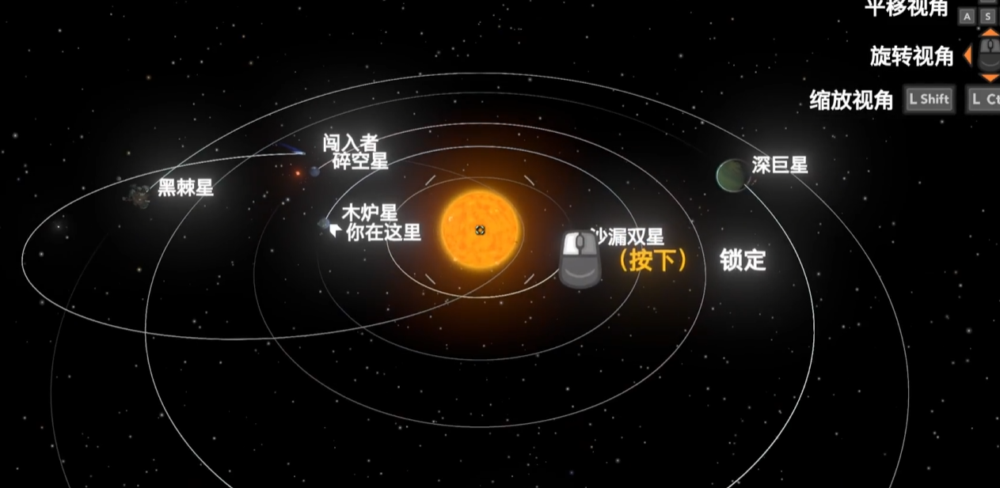
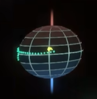

鼠标控制视角
空格拾取材料，长按建造
左上角小地图，玩家位置-红点

#### to-do list
- [ ] 飞船操控逻辑
- [x] 角色操控逻辑  
wasd移动，空格跳跃，鼠标操控视角  
- [x] 星球重力  
每个星球有各自的重力范围以及重力强度等，进入范围自动捕获角色
- [x] 大地图  
M键打开大地图，实时显示整个星系以及角色位置

- [x] 小地图  

- [ ] 飞船模型、可探索的星球模型（是一个球形，不是平面）